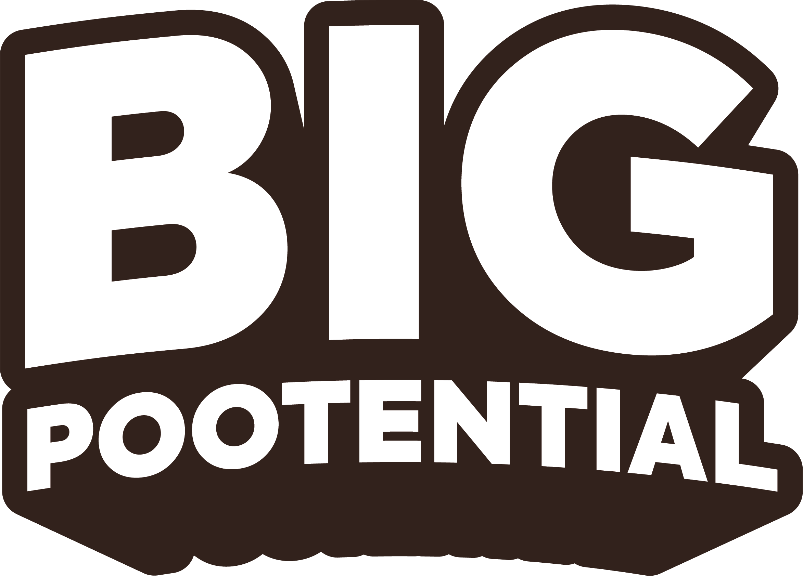
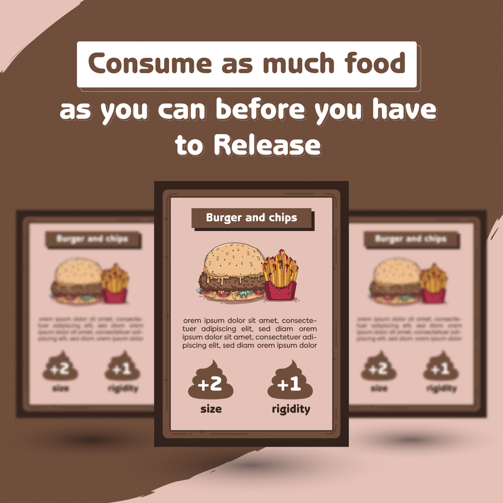
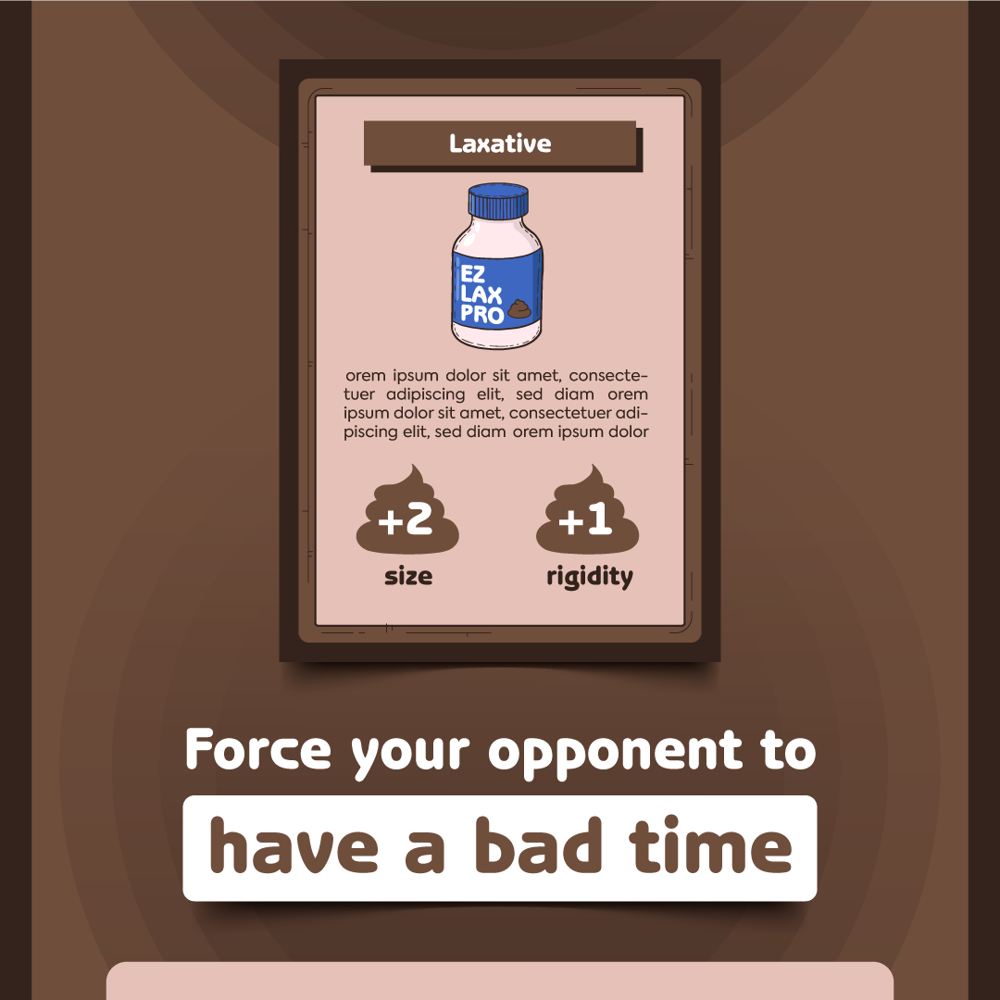
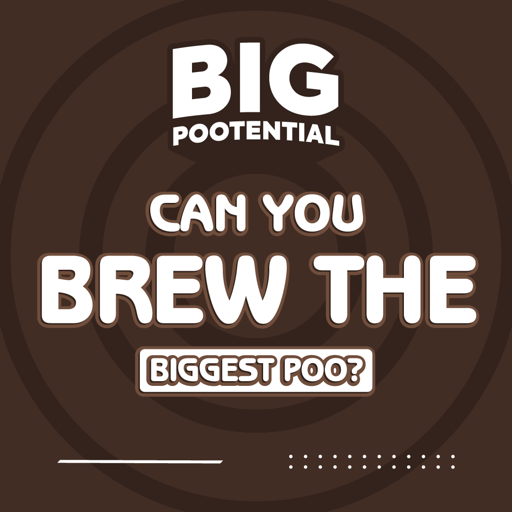
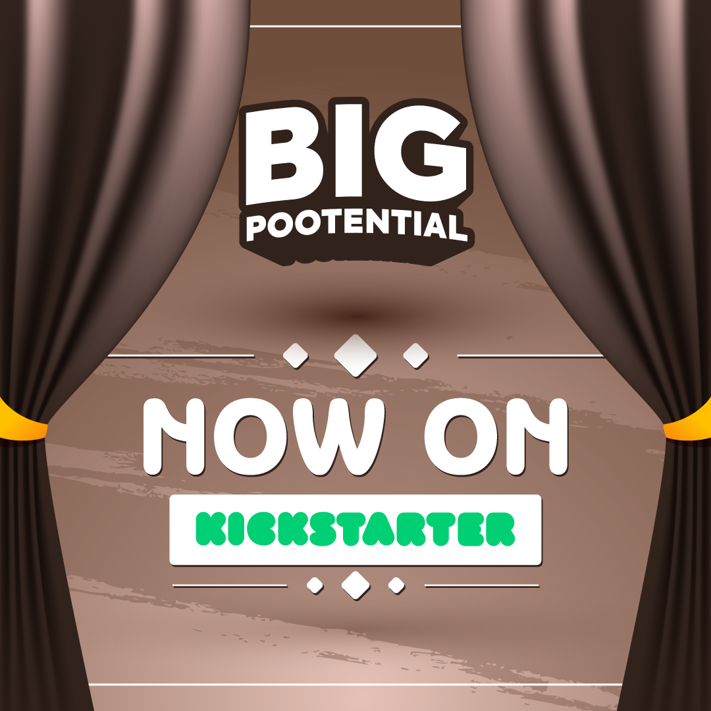

## Story

### A fun game all about who can brew up the biggest poo! But be careful you don't poo too soon!"

Hi All, It's Tom and Ed. CPO's (Chief Poo Officers) of Team About LTD, about to bring you the most exciting new card game...all about poo!

## Meet the Creators

<b>Tomas Pilvelis</b>: Over the past 10 years, I don't think there has not been a day where we have not spoken about poo.

<b>Edward Cook</b>: Theres nothing more life affirming than brewing a nice poo all day, taking the weight off by sitting on the toilet, and then squeezing out a hoggie.

During our friendship we have mainly spoken about our poos, this lead to the idea of turning our love for poo into a card game. After much descussion we decided to go for it, what have we got to lose?! We have tested prototypes of Big Pootential and we think now is the time to start putting it out to the world.

We enjoy playing Big Pootential and we hope you will too!

## Rewards

_Folder/Post-2.2(kickstarter).png)
_Folder/Post-4.1(kickstarter).png)

| Pledge Minimum | Title | Description | Deck of Cards Reward | A1 Poo Poster |
| --- | --- | --- | --- | --- |
| £10 | Pledge Without Reward | Support the project, show some love to see the project comes to light | 🟥 | 🟥 |
| £25 | Pledge & Pre Order | Pledge your support to make this project work and pre order Big Pootential Card Game to arrive before Christmas! | 🟩 | 🟥 |
| £50 | Pledge & Pre Order & A1 Poo Poster | Hot off the poo press | 🟩 | 🟩 |

## Rules

### Game Rules

_Folder/Post-2.1(kickstarter).png)

1-4 players

Shuffle deck, Player who pooed most recently goes first.

Place the desk in the middle of the players. Clockwise game play.

Each player picks up a card and adds it to their pile.

If you pick up a ‘Release’ Card you are out of the game. Count up your Pootential Points.

Keep going until everyone has released. Player with most Pootential points wins.

Action cards have stated action on card.

Discarded cards should be added to a ‘toilet’ pile.

If a draw in points happens draw a card and add that to your total. If you draw an action card discard it and draw another card until you draw a food card.

### Drinking Game Rules

#### Drink on drinks

Everytime you get a drink card, you drink

#### Higher or Lower

Place the cards upside down, fip a card upwards. Then guess the next card to be higher or lower, then flip. If a correct guess Well Done, if wrong DRINK!

## Risks and challenges

We don't foresee risks as of now as the project has been self-funded till now, as a project that we are really keen on creating for everyone to enjoy, and a brainchild that we want to see come alive!

Simply put, we will do everything in our power to release this Big Pootential.

